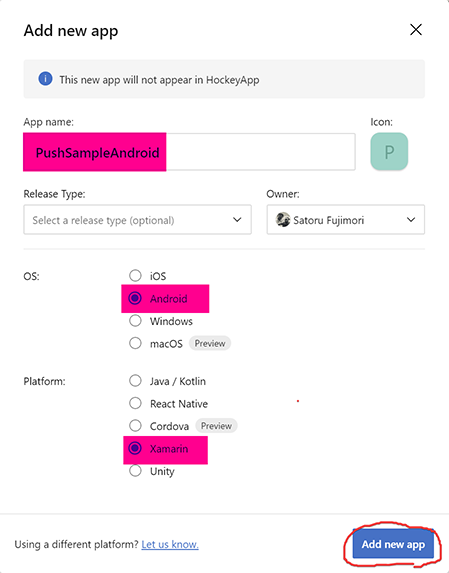
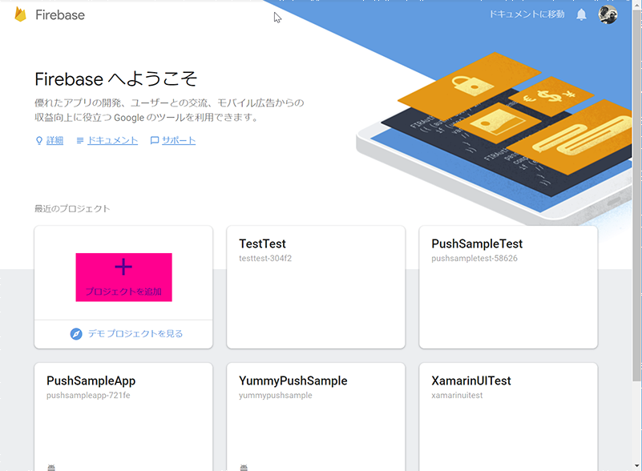
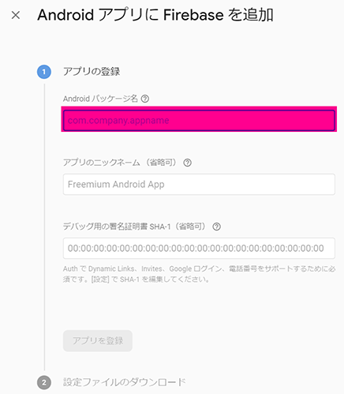
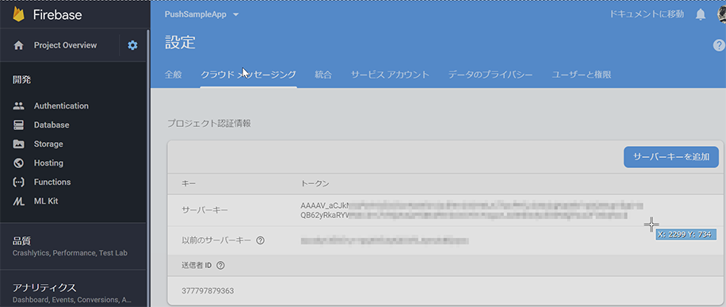

## App Center でのプッシュ通知の環境構築
プッシュ通知の環境構築には App Center と Firebase の設定が必要になります。ここでは App Center Push と Firebase Cloud Messaging の設定方法を説明します。

以下の手順をおこなうことでプッシュ通知の環境構築をおこなうことができます。

1. App Center でアプリケーションを追加する
2. App Center で Push 環境を設定する
3. Firebase で プロジェクトを作成する
4. Firebase で Cloud Messaging を追加する
5. Firebase と App Center Push を関連付ける

### 1. App Center でアプリケーションを追加する

- [App Center](https://appcenter.ms/) にログインします
- `All apps` から右上の `Add new` → `Add new app` をクリックします
- App name: でアプリケーション名の入力、OS: は Android、Platform: は Xamarin を選択します
- 右下の `Add new app` をクリックします

### 2. AppCenter で Push 環境を設定する
- 作成したアプリケーションを選択して、Push をクリックします
- Xamarin 用のコードをコピーします（Xamarin プロジェクトで使用します）

### 3. Firebase でプロジェクトを作成する

- [Firebase](https://firebase.google.com/?hl=ja) にログインします
- 右上の「コンソールへ移動」をクリックします
- 「プロジェクトを追加する」をクリックします

### 4. Firebase で Cloud Messaging を追加する

- Firebase コンソール（の左上）の設定→「プロジェクトの設定」をクリックします
- 「Android アプリに Firebase を追加」をクリックします
- 「Android パッケージ名」は Xamarin の Android プロジェクト → プロパティ → Android マニフェスト → 「パッケージ名」をコピペします。 
- 「アプリを登録」をクリックすると `google-services.json` をダウンロードできるのでこれを保存しておきます（Xamarin プロジェクトで使用します）

### 5. Firebase と App Center Push を関連付ける
- Firebase の設定画面の「クラウドメッセージング」の「サーバーキー」をコピーします
- App Center の `Add Server Key` にペーストします

参考: [Get Started with Xamarin](https://docs.microsoft.com/en-us/appcenter/sdk/getting-started/xamarin)
