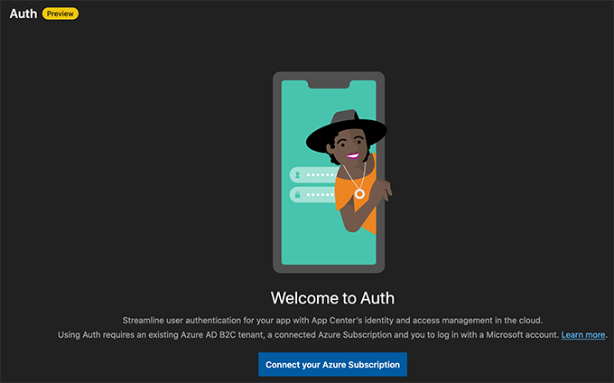
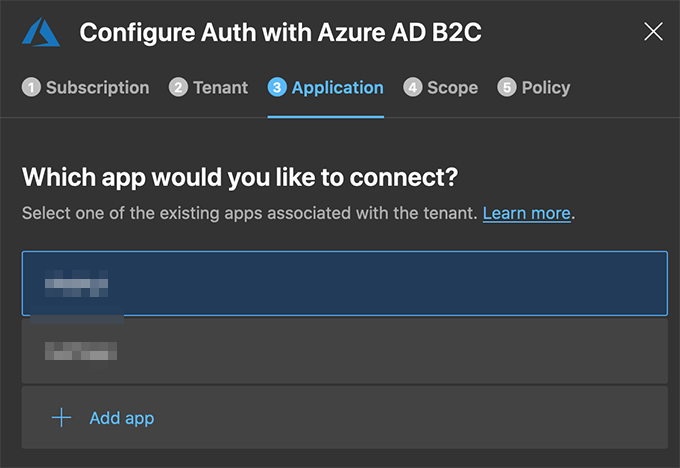
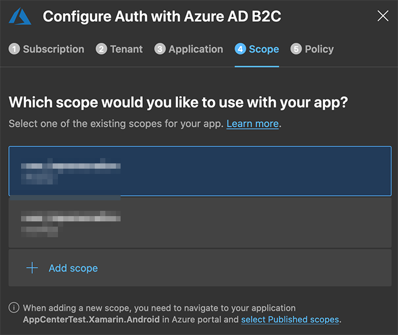
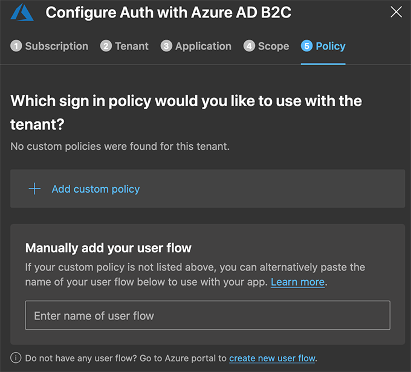
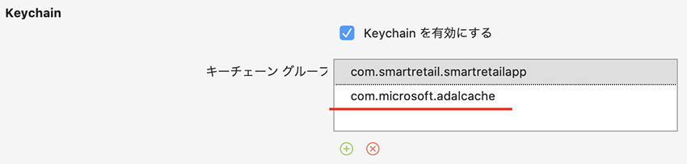

# Azure AD B2C によるログインの実装
ここでは Azure AD B2C と App Center Auth の仕組みを利用して、クライアントアプリへの認証によるログインの実装方法を説明します。

## Azure ポータルでの Azure AD B2C の設定
### Azure AD B2C テナントの作成
1. Azure Portal の右上にある 「ディレクトリ + サブスクリプション」をクリックして、利用するサブスクリプションとディレクトリを選択します。（なお、このディレクトリはこれから作成する Azure AD B2C テナントとは**異なります**。）
2. Azure Portal から [リソースの作成] をクリックします。
3. [Create a new Azure AD B2C Tenant] をクリックして、Azure AD B2c テナントを作成します。
4. 「組織名」と「初期ドメイン名」を入力します。 「国/リージョン」で `日本` を選択し、「作成」ボタンをクリックします。作成にしばらく時間がかかります。
5. テナント作成ページの上部にある [Create new B2C Tenant or Link to existing Tenant] リンクをクリックします。
6. [Link an existing Azure AD B2C Tenant to my Azure subscription] を選択します。
7. 作成した Azure AD B2C テナントを選択し、ご利用のサブスクリプションを選択します。
[リソース グループ] には [新規作成] を選択します。 テナントを含むリソース グループの名前を入力し、リソース グループの場所を選択してから、 [作成] を選択します。
### 作成した Azure AD B2C テナントを選択
1. Azure Portal の右上にある [Directory + Subscription] をクリックして、作成した Azure AD B2C テナントのディレクトリを選択します。
### アプリケーションの登録
1. [アプリケーション] を選択して、[追加] をクリックします。
2. アプリケーションの名前を入力します。 たとえば、webapp1 とします。
3. [ネイティブ クライアントを含める] には、 [はい] を選択します。
4. [応答 URL] にはテナント ID を概要からコピーして下記の形式で入力します。
  `msal{Your Tenant ID}://auth`
### クライアントシークレットの作成
1. [Azure AD B2C - アプリケーション] ページで、作成したアプリケーション ( webapp1) を選択します。
2. [キー] をクリックして、 [キーの生成] を選択します。
3. [保存] をクリックして、キーを参照します。アプリキーの値をメモしておきます
### ユーザーフローの作成
1. Azure Potal で [Azure AD B2C] を検索して選択します。
2. [ポリシー] で、 [ユーザーフロー(ポリシー)] を選択し、[新しいユーザーフロー] をクリックします。
3. [推奨] タブで [サインアップとサインイン] ユーザーフローを選択します。
4. ユーザー フローの [名前] を入力します。 たとえば、`signupsignin1` と入力します。
5. [ユーザー属性と要求] で、サインアップ中にユーザーから収集して送信する要求と属性を選択します。 たとえば、 [Show more] を選択し、 [国/リージョン] 、 [表示名] 、 [郵便番号] の属性と要求を選択します。 [OK] をクリックします。

参考: https://docs.microsoft.com/ja-jp/azure/active-directory-b2c/tutorial-create-tenant

## App Center Auth の設定
上記で作成した Azure AD B2C のテナントを App Center に紐付ける作業をおこないます。

- App Center ポータルからアプリケーションを選択
- 左側のメニューから `Auth` をクリック
- `Connect your Azure Subscription` をクリック
- 該当するサブスクリプションを選択して、`Next` をクリック
- 該当するテナントを選択して、`Next` をクリック
- 該当するアプリケーションを選択して、`Next` をクリック
- 該当するスコープを選択して、`Next` をクリック
- ポリシータブでは作成したユーザーフローを**入力**して、`Connect` をクリック








*TBD*
## クライアントアプリへ App Center Auth を追加する（共通）
- `Microsoft.AppCenter.Auth` パッケージを追加します（共通, iOS, Android）。
- `App.xaml.cs` に `typeof(Auth)` を追加します。
```diff
+ using Microsoft.AppCenter.Auth;
...
  AppCenter.Start($"android={Constant.AppCenterKeyAndroid};"
  　　+ "uwp={Your UWP App secret here};"
  　　+ $"ios={Constant.AppCenterKeyiOS}",
-  　　typeof(Push));
+  　　typeof(Push),typeof(Auth));
```

## クライアントアプリへの実装（iOS）
- `info.plist` へ下記を追加します。`VSCode` などのエディタなどを使用すると編集しやすいです。`{Your App Secret}` は `App Center` → アプリケーション → 概要（Overview）→ Xamarin.Forms にあるキーをコピペします。 

info.plist

```xml
<key>CFBundleURLTypes</key>
<array>
    <dict>
        <key>CFBundleTypeRole</key>
        <string>Editor</string>
        <key>CFBundleURLName</key>
        <string>$(PRODUCT_BUNDLE_IDENTIFIER)</string>
        <key>CFBundleURLSchemes</key>
        <array>
            <string>msal{Your AppCenter Key}</string>
        </array>
    </dict>
</array>
```

- Visual Studio For Mac から Entitlements.plist をクリックして以下をおこないます
  - 「Key Chain を有効にする」をチェック
  - +をクリックして、`com.microsoft.adalcache` 追加




## クライアントアプリへの実装（Android）
- `AndroidManifest.xml` の `<application>` タグ内に以下を追加します。`{Your App Secret}` は `App Center` → アプリケーション → 概要（Overview）→ Xamarin.Forms にあるキーをコピペします。 

Properties/AndroidManifest.xml
```xml
<activity android:name="com.microsoft.identity.client.BrowserTabActivity">
    <intent-filter>
    <action android:name="android.intent.action.VIEW" />
    <category android:name="android.intent.category.DEFAULT" />
    <category android:name="android.intent.category.BROWSABLE" />
    <data
        android:host="auth"
        android:scheme="msal{Your App Secret}" />
    </intent-filter>
</activity>
```

## クライアントアプリへのログイン／ログアウトの実装
- `App.xaml.cs` にログインとログアウトを実装します

App.xaml.cs

```diff
  public partial class App : Application
  {
    public string CartId { get; set; }
    public string BoxId { get; set; }
+   public UserInformation UserInfo { get; set;}
...
+ ///
+ /// サインイン
+ ///
+ public async Task<bool> SignInAsync()
+ {
+     try
+     {
+         this.UserInfo = await Auth.SignInAsync();
+         string accountId = this.UserInfo.AccountId;
+     }
+     catch (Exception e)
+     {
+         return false;
+     }
+     return true;
+ }
+ ///
+ /// サインアウト
+ ///
+ public void SignOut()
+ {
+     Auth.SignOut();
+     this.UserInfo = null;
+ }

```

- `LoginPage.xaml` にログインボタンを追加します

LoginPage.xaml
```diff
...
  <Button Margin="0,10,0,0"
          x:Name="btnStartShopping"
          Clicked="LoginClicked"
          Text="買い物を開始します" />
+ <Button x:Name="btnLoginLogout"
+         Text="ログイン" />
```

- `LoginPage.xaml.cs` にログインボタンをクリックしたら上記のログインを呼び出します

```diff
...
  public LoginPage()
  {
    InitializeComponent();

    loadingIndicator.IsRunning = false;
    loadingIndicator.IsVisible = false;
    edtBoxName.Text = "SmartBox1";
+   btnStartShopping.IsEnabled = false;
+
+   // クリックしたときに認証画面へ遷移する
+   btnLoginLogout.Clicked += async (sender, e) =>
+   {
+       if (btnLoginLogout.Text == "ログアウト")
+       {
+           await SignOut();
+       }
+       else
+       {
+           var app = Application.Current as App;
+           if (await app.SignInAsync() != true)
+           {
+               await DisplayAlert("ログインできませんでした", "","OK");
+           }
+           else
+           {
+               await DisplayAlert("ログインしました", "", "OK");
+               btnLoginLogout.Text = "ログアウト";
+               btnStartShopping.IsEnabled = true;
+           }
+       }
+   };
+   async Task SignOut()
+   {
+     var app = Application.Current as App;
+     app.SignOut();
+     btnLoginLogout.Text = "ログイン";
+     btnStartShopping.IsEnabled = false;
+     await DisplayAlert("ログアウトしました", "", "OK");
+   }
...
```
