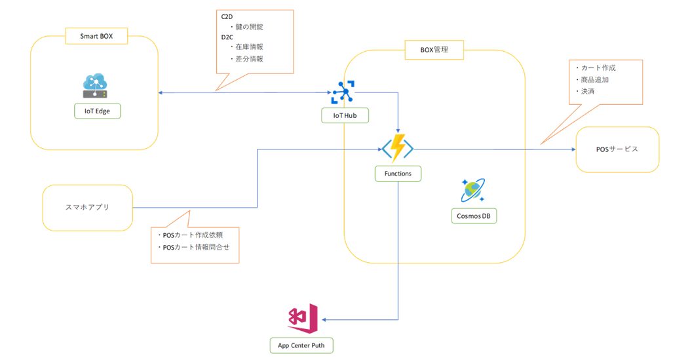

# Box管理サービス

## アーキテクチャ概要

Smart Box (IoT Edge) からD2Cのメッセージを [Durable Functions](https://docs.microsoft.com/ja-jp/azure/azure-functions/durable/durable-functions-overview) を使用し、Smart Boxの状態により処理を振り分けるステートフルワークフローを採用しました。  
また、Smart Boxの状態の変化をリアルタイムでスマホアプリに反映するために [App Center Push](https://docs.microsoft.com/en-us/appcenter/push) を使用しています。

## 主な特長

- IoT Edge連携
  - D2Cメッセージを [IoT Hub](https://docs.microsoft.com/ja-jp/azure/iot-hub/about-iot-hub) が受け、 Event Hub Trigger によりBox管理サービスの Durable Functions が呼び出され、メッセージの内容を処理します。
  - C2Dメッセージを IoT Hub 経由で送ることにより、 Smart Box のデバイスを操作します。
- Smart Box 状態管理
  - Smart Box のドアの状態や、ドア開閉時の在庫の状態を管理します。
  - Smart Box がどのスマホアプリのIDと紐づいているかを管理します。
  - Smart Box がPOSサービスのどのカートと紐づいているかを管理します。
- [POSサービス](pos-service.md) 連携
  - POSサービスへカート作成/商品追加/決済の依頼を行います。
  - Smart Box のAIが認識した商品IDをPOSサービスが処理可能なJANコードに変換してPOSサービスのAPIを呼び出します。
  - Smart Box の扉が閉まると、POSサービスの小計API → 支払い追加API → 取引確定APIを順番に呼び出し、POSカートを確定させます。
  - POSサービスの処理結果に応じて App Center Push を使用してスマホアプリに通知を行います。
