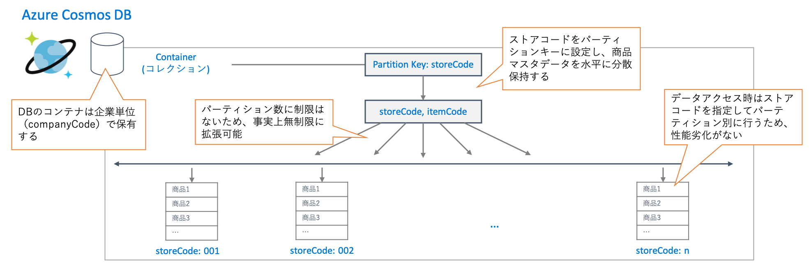

# 統合商品マスター

## アーキテクチャ概要

データストアとして、NoSQL データベースである [Azure Cosmos DB](https://docs.microsoft.com/ja-jp/azure/cosmos-db/introduction) を採用することで、ハイパースケールにも対応可能な統合商品マスターを実現しています。また、スキーマフリーの NoSQL DB を利用することで、商品毎のデータ属性の違いも柔軟に吸収することが可能となっています。

## 主な特長

- スキーマフリーのNoSQLデータベースを利用
  - 店舗ごと、商品ごとに異なるデータ属性を吸収できる
  - マスターメンテナンス時のスキーマ変更作業が不要に
- スケール可能なパーティショニング
  - パーティション分割（シャーディング）により、事実上無制限に水平スケールが可能
  - 店舗単位でパーティションを分割し、店舗ごとにI/Oを分散
- 利用頻度に応じてパフォーマンス調整が可能
  - 企業単位にDBの最大スループットを調整可能
  - データ量増加による性能劣化がないパフォーマンスSLA

## 参考

- [NoSQL データベースのドキュメント データのモデル化 | Microsoft Docs](
https://docs.microsoft.com/ja-jp/azure/cosmos-db/modeling-data)
- [シャーディング パターン | Microsoft Docs](
https://docs.microsoft.com/ja-jp/azure/architecture/patterns/sharding)
- [データの水平的、垂直的、および機能的パーティション分割 | Microsoft Docs](
https://docs.microsoft.com/ja-jp/azure/architecture/best-practices/data-partitioning)
