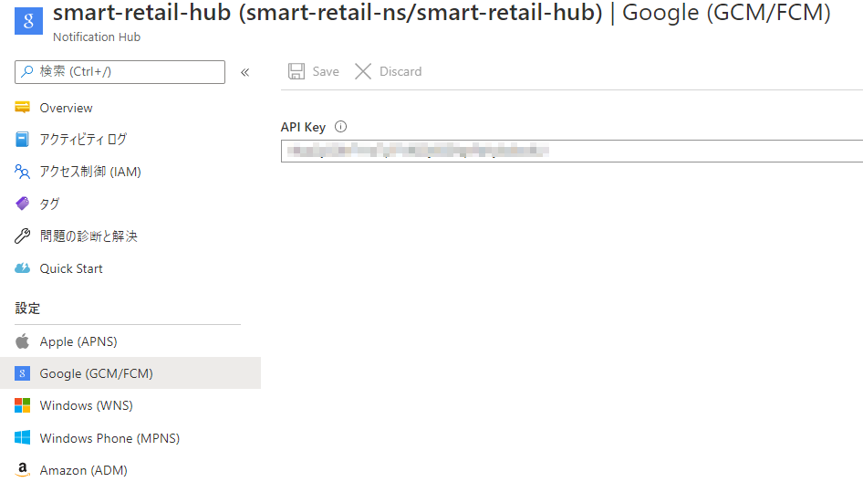
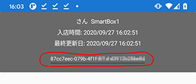

## Azure Notification Hub でのプッシュ通知の環境構築
プッシュ通知の環境構築には Azure Notification Hub と Google Firebase の設定が必要になります。ここでは Azure Notification Hub と Google Firebase Cloud Messaging（FCM） の設定方法を説明します。

以下の手順をおこなうことでプッシュ通知の環境構築をおこなうことができます。

1. Google Firebase でプロジェクトを作成する
1. Android のパッケージ名を取得する
1. Google Firebase で Cloud Messaging を追加する
1. Azure Notification Hub を作成する
1. FCM の設定を Azure Notification Hub 用に構成する
1. Azure Notification Hub の値を Xamarin のプロジェクトに設定する
1. プッシュ通知をテスト送信する

### 1. Google Firebase でプロジェクトを作成する

- [Google Firebase](https://firebase.google.com/?hl=ja) にログインします
- 右上の「コンソールへ移動」をクリックします
- 「プロジェクトを追加」をクリックし、下記を参考にプロジェクトを作成します
  - 「プロジェクト名」に任意の名前を入力します
  - 「このプロジェクトで Google アナリティクスを有効にする」のトグルは、必要に応じてチェックをしてください。有効にする場合は Google アナリティクスアカウントの選択または新規作成を促されます。


### 2. Android のパッケージ名を取得する

#### Visual Studio で Android のパッケージ名を確認する場合

- Visual Studio で、 `src/arm-template/client-app/SmartRetailApp/SmartRetailApp.sln` を開きます
- 「Solution Explorer」の Android プロジェクト（Androidスマートフォンのようなアイコン）の `SmartRetailApp.Android` をクリックします
- 開いた画面の左メニューから「Android Manifest」を開きます
- 「Package name:」の値をコピーしておきます

#### コードから Android のパッケージ名を確認する場合

- `src\client-app\SmartRetailApp\SmartRetailApp\SmartRetailApp.Android\Properties\AndroidManifest.xml` を開きます
- `<manifest>` タグの `package` プロパティの値をコピーしておきます

### 3. Google Firebase で Cloud Messaging を追加する

- Google Firebase コンソール（の左上）の設定→「プロジェクトの設定」をクリックします
- 「General」（または、「全般」）タブの「Your apps」（または、「マイアプリ」）で、Androidのキャラクターのアイコンをクリックします
- 「Android パッケージ名」に、4. で取得したパッケージ名を貼り付けます
- 「アプリを登録」をクリックすると `google-services.json` をダウンロードできるのでこれを保存しておきます（Xamarin プロジェクトで使用します）


### 4. FCM の設定を Azure Notification Hub 用に構成する

- Google Firebase の設定画面の「クラウドメッセージング」の「サーバーキー」をコピーします
- Azure Portal の Notification Hub から 「Google (GCM/FCM)」をクリックします
- サーバーキーをペーストします
- 「Save」をクリックします




## 5. Azure Notification Hub の値を Xamarin のプロジェクトに設定する
- `SmartRetailApp\Models\Constant.cs` に値を設定します
  - `ListenConnectionString`: Notification Hub の Access Policies の「box-service-listen-only」の値
  - `NotificationHubName`: Notification Hub のハブ名の値

```cs
// 接続文字列
// Azure Portal → Notification Hub → Access Policies → 「box-service-listen-only」の値
// ※ Listen のみの接続文字列でないと動作しないので注意
public const string ListenConnectionString = "Endpoint=sb://***.servicebus.windows.net/;SharedAccessKeyName=box-service-listen-only;SharedAccessKey=***";

/// <summary>
/// Notification Hub のハブ名
/// </summary>
public const string NotificationHubName = "<PREFIX>-box-service";
```

## 6. プッシュ通知をテスト送信する
サンプルプログラムを使用してデバイスにプッシュう通知を送信するテストをおこないます。
- ` src/test/SendPush.Sample/local.settings.sample.json` を `local.settings.json` にリネームします
- 以下の値を設定します
  - `NotificaitonHubConnectionStrings`: Azure Notification Hub の Access Policies の「box-service-full-access」の値
  - `NotificationHubName`: Notification Hub のハブ名の値
```json
{
    "NotificaitonHubConnectionStrings": "Endpoint=sb://***.servicebus.windows.net/;SharedAccessKeyName=box-service-full-access;SharedAccessKey=***",
    "NotificationHubName": "<PREFIX>-box-service",
}
```
  - デバイスでアプリを起動してデバイス ID をコピーします
    - デバイス ID の取得方法は、「買い物を開始します」をタップした後、カメラの画面をキャンセル（戻る）→ 画面上部に表示されているのでこれをコピーします
　　
  - `src\test\SamplePush.Sample\SamplePush.Sample.csproj` を VSCode で開きます
  - Terminal を起動して下記のコマンドを実行します
    > dotnet build
    
    > dotnet run sendpush --deviceIdList {コピーしたデバイスID}
  - 実行するアクション（カートの更新または清算）を聞かれるので選択します
    ```
    ? Select Action
    > update_cart
      receipt
    ```
  - デバイスで画面が遷移することを確認します


参考: [Get Started with Xamarin](https://docs.microsoft.com/en-us/appcenter/sdk/getting-started/xamarin)
