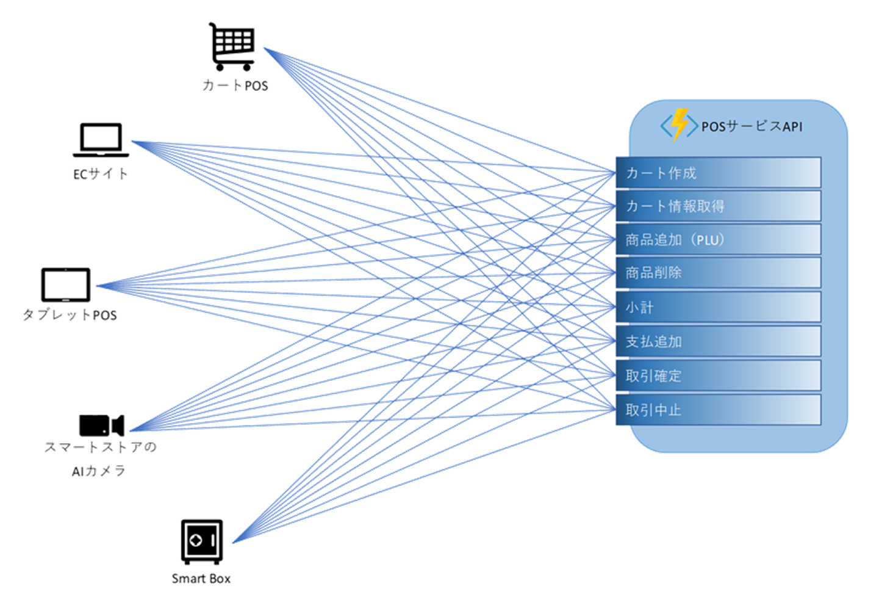

# POSサービス

## アーキテクチャ概要

カート作成、商品追加等のPOSに必要な機能を [Azure Functions](https://docs.microsoft.com/ja-jp/azure/azure-functions/functions-overview) の Web API (HTTP Trigger) で提供します。  
POSロジックの実態を Azure Functions 上に配置することにより Smart Box でもECサイトでもAPIを呼び出すだけでPOSとして動作するため、業務形態に依存せずシステムを構築できます。  
カート情報は [Azure Cosmos DB](https://docs.microsoft.com/ja-jp/azure/cosmos-db/introduction) に保持することでスケーラビリティとパフォーマンスを確保します。
カート情報には有効期限 Time To Live を設定し、古くなったカート情報を自動的に削除しています。

## 主な特長

- POS機能
  - POSに必要な以下機能を Web API として提供します。
    - カート作成要求
    - カート状態取得
    - 商品追加
    - 商品削除
    - 小計
    - 支払追加
    - 取引確定
    - 取引中止
  - 確定した取引を Azure Cosmos DB に書き込みます。Azure Cosmos DB に書き込むことにより Change Feed で取引をリアルタイムで検知し Azure Functions に連携することや、[Azure Data Factory](https://docs.microsoft.com/ja-jp/azure/data-factory/introduction) と連携する等を行うことで、たとえば売上速報値の集計など、多様な処理との連携が可能です。
- 統合商品マスター連携
  - 統合商品マスターサービスから追加する商品の情報を取得します。
- 在庫管理サービス連携
  - 商品追加APIが呼び出された際、商品の仮引当てを行います。
  - 取引確定APIが呼び出された際、商品の本引当てを行います。
  - 上記の在庫管理サービス連携により在庫をリアルタイムに管理することが可能になります。
