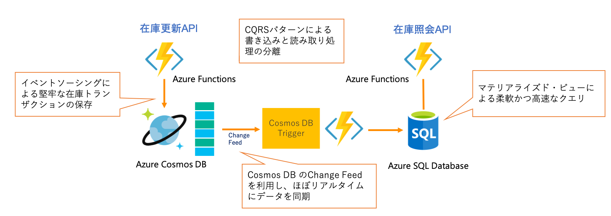

# 在庫管理サービス

## アーキテクチャ概要

在庫の更新と照会それぞれの処理特性が異なるため、CQRSパターンを応用しスケーラビリティとパフォーマンスを両立しています。更新側には高速な書き込みが可能な [Azure Cosmos DB](https://docs.microsoft.com/ja-jp/azure/cosmos-db/introduction) を利用し、照会には柔軟なクエリに対応できる [Azure SQL Database](https://docs.microsoft.com/ja-jp/azure/sql-database/sql-database-technical-overview) を採用しました。

## 主な特長

- CQRSパターンによる書き込みと読み取り処理の分離
  - 読み取りストアと書き込みストアを分離。それぞれの負荷に合わせて適切にスケーリングが可能。
  - 書き込みストアと読み取りストア間は、Azure Cosmos DB のChange Feed を利用し、ほぼリアルタイムに読み取りストアにデータを同期。
- イベントソーシングによる堅牢な在庫トランザクションの保存
  - 更新側のデータストアを追記専用とし、在庫の変動を全てイベントとして順次記録することで、特定時点の在庫の状態を再生可能に。
- マテリアライズド・ビューによる柔軟なクエリ
  - 更新側のデータ構造に影響されず、読み込みに特化したスキーマを設計でき、柔軟にクエリを実行できる。

## 参考

- [コマンド クエリ責務分離 (CQRS) パターン - Cloud Design Patterns | Microsoft Docs](https://docs.microsoft.com/ja-jp/azure/architecture/patterns/cqrs)
- [イベント ソーシング パターン - Cloud Design Patterns | Microsoft Docs](https://docs.microsoft.com/ja-jp/azure/architecture/patterns/event-sourcing)
- [マテリアライズド・ビュー パターン - Cloud Design Patterns | Microsoft Docs](https://docs.microsoft.com/ja-jp/azure/architecture/patterns/materialized-view)
