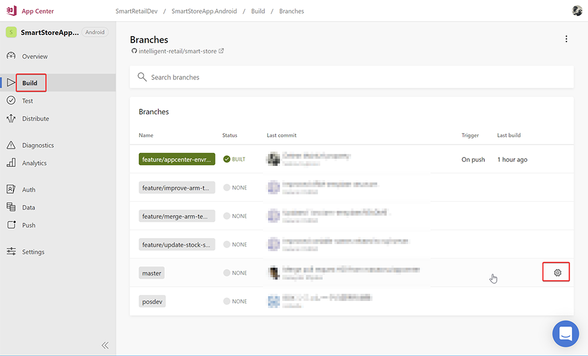
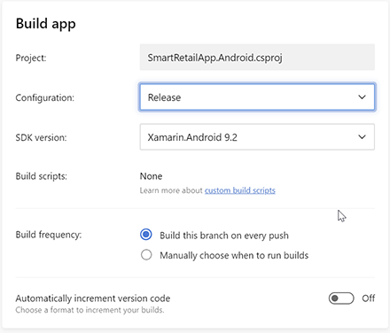
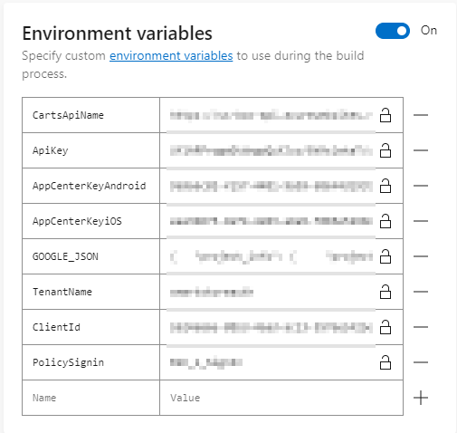
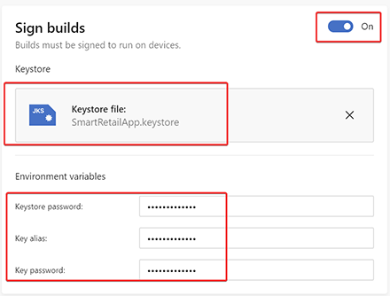
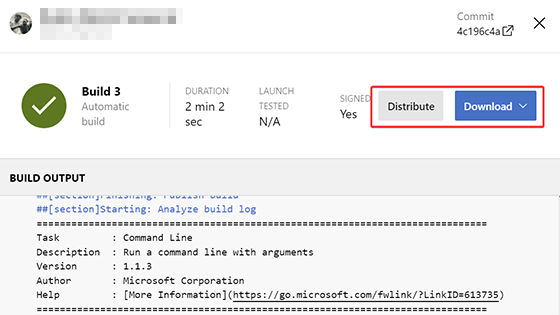

# client-app

`client-app` には `Xamarin.Forms` で構成された、クライアントアプリを実行するための以下のサンプル実装が含まれています。クライアントアプリの概要は [こちら](../../docs/client-app.md) を参照してください。

## SmartRetailApp

クライアントアプリの共通ライブラリです。以下の `SmartRetailApp.Android` と `SmartRetailApp.iOS` で共通で使用される `XAML` によるUI や `API` によるデータ取得、プッシュ通知などほとんどの機能が実装されています。

## SmartRetailApp.Android

`Android` で実行するためのプロジェクトです。

## SmartRetailApp.iOS

`iOS` で実行するためのプロジェクトです。

## プロジェクトをビルドするために必要な作業
プロジェクトをビルドするために以下の作業が必要になります。

1. Constant.cs の書き換え
1. google-services.json のコピー（ Android のみ）

### Constant.cs の書き換え
共通プロジェクトの `Models/Constant.cs` の定数を書き換えます。

- `CartsApiName`: `https://<PREFIX>-box-api.azurewebsites.net/api/v1/carts`
- `ApiKey`: _<PREFIX>-box-api_ に設定したAPIキー
- `AppCenterKeyAndroid`: App Center -> Overview の手順 2. Start the SDK の `AppCenter.Start("<この部分>", ...)`
- `AppCenterKeyiOS`: iOS 用 App Center 用のキー
- `Your_Tenant_Name`: Azure AD B2C のテナント名
- `Your_Client_Id`: Azure AD B2C のクライアントID（アプリケーションID）
- `Your_Policy_Name`: Azure AD B2C のユーザーフロー
- `Your_Bundle_Identifier`: バンドル識別子（iOSのみ）

```c#
public class Constant
{
  // Cart API の名前
  public const string CartsApiName = "your_CartsApiName";

  // APIのキー
  public const string ApiKey = "your_ApiKey";

  // AppCenter Android用のキー
  public const string AppCenterKeyAndroid = "your_AppCenterKeyAndroid";

  // AppCenter iOS用のキー
  public const string AppCenterKeyiOS = "your_AppCenterKeyiOS";

  // Azure AD B2C のテナント名 例）"contoso123tenant"
  // ポータル → Azure AD B2C → 概要 → ドメイン名の .onmicrosoft.com を除いた部分
  static readonly string tenantName = "Your_Tenant_Name";

  // Azure AD B2C のクライアントID（アプリケーションID）例）"aaaaaaaa-bbbb-cccc-dddd-eeeeeeeeeeee"
  // ポータル → Azure AD B2C → アプリケーション → アプリケーション ID
  static readonly string clientId = "Your_Client_Id";

  // Azure AD B2C のユーザーフロー 例）"B2C_1_signupsignin"
  // ポータル → Azure AD B2C → ユーザーフロー
  static readonly string policySignin = "Your_Policy_Name";

  // バンドル識別子（iOSのみ） 例）com.sample.contoso
  // iOS プロジェクト→プロパティ→バンドル識別子
  static readonly string iosKeychainSecurityGroup = "Your_Bundle_Identifier";
...
}
```

### google-services.json のコピー（ Android のみ）
[FireBase](https://console.firebase.google.com/) で作成したアプリから　`google-services.json` をダウンロードして、`SmartRetailApp.Android` プロジェクトの `google-services.json` （最初は空）へコピペしてください。

## App Center でビルドする場合
`App Center` では上記の `Constant.cs` の各値と `google-services.json` の内容を `App Center Build` に変数（`Environment variables`）を設定することで継続的にビルド（ `Continous Integration` ）をおこなうことができます。

ここでは `master` ブランチにプッシュされる都度ビルドを行う設定を説明します。

1. `App Center` で `Build` をクリックします
2. ビルドをおこなうブランチ（ここでは `master` ブランチ）の設定ボタンをクリックします



3. `Build app` の設定でビルドをおこなうプロジェクトを選択します。
   - `Configuration` は `Release` を選択します。
   - `Build frequency` の `Build this branch on every push` をチェックするとプッシュされる都度ビルドが実行されます。



4. `Environment variables` の設定を `on` にして各変数をコピペします。

|  変数名  |  値  |
| ---- | ---- |
|  GOOGLE_JSON  |  google-services.json の内容  |
|  CartsApiName  |  API の URL  |
|  ApiKey  |  API の Key  |
|  AppCenterKeyAndroid  |  Android 用 App Center 用のキー  |
|  AppCenterKeyiOS  |  iOS 用 App Center 用のキー  |
|  TenantName  |  Azure AD B2C のテナント名  |
|  ClientId  |  Azure AD B2C のクライアントID（アプリケーションID）  |
|  PolicySignin  |  Azure AD B2C のユーザーフロー  |
|  BundleIdentifier  |  バンドル識別子（iOSのみ）  |



5. `Sign Builds` で `Android` 用の証明書を設定します

|  変数名  |  説明  |
| ---- | ---- |
|  Keystore file  |  署名ファイルをアップロードします(※)  |
|  Keystore password  |  署名ファイルを作成する際に指定したパスワード  |
|  Key alias  |  署名ファイルを作成する際に指定した Alias (SmartRetailApp)  |
|  Key password  |  Keystore password と同じパスワード  |

※ 署名ファイルは、下記の手順で作成します。
- `google-services.json` を `src\client-app\SmartRetailApp\SmartRetailApp\SmartRetailApp.Android` に置きます。（同名のファイルがあるので、上書きするか、元のファイルを退避してから配置してください。）
- Visual Studio で `src\client-app\SmartRetailApp\SmartRetailApp.sln` を開きます。
- 画面上部の Solution Configurations （または、「ソリューション構成」）を `Release` に変更します。
- Solution Explorer （または、「ソリューション エクスプローラー」）の `SmartRetailApp.Android` を右クリックし、 `Archive...` （または、「アーカイブ...」）を選択します。
- Archive が終わりましたら、右下に表示された `Distribute...` （または、「配布...」） ボタンをクリックします。
- `Ad Hoc` （または、「アドホック」）を選択し、 `+` ボタンをクリックします。 
- Create Android Keystore ダイアログで、下記を入力し、 `Create` （または、「作成」）ボタンをクリックします。
  - Alias （または、「エイリアス」）に `SmartRetailApp` を入力します。
  - Password （または、「パスワード」）に任意の文字列を指定します。この Alias と Password は App Center の Sign builds の Environment variables にも指定するので、覚えておいてください。
  - Full Name （または、「完全名」）に任意の文字列を入力します。
- この時点で、Windows の場合 `C:\Users\{User}\AppData\Local\Xamarin\Mono for Android\Keystore\SmartRetailApp\SmartRetailApp.keystore` に署名ファイルが作成されます。



6. `Save` または `Save and Build` をクリックして保存します
7. ビルドされた `.apk` ファイルは `Download` ボタンでダウンロードできます。また `Distribute` をクリックするとコラボレーターにビルド後の .apk ファイルを自動的に配信をすることもできます。




## ライセンス

### AppCenter-SDK-DotNet
AppCenter-SDK-DotNet is released under the MIT License.
AppCenter-SDK-DotNet can be found here: [https://github.com/Microsoft/AppCenter-SDK-DotNet](https://github.com/Microsoft/AppCenter-SDK-DotNet)
A copy of the MIT License can be found here: [https://github.com/Microsoft/AppCenter-SDK-DotNet/blob/develop/license.txt](https://github.com/Microsoft/AppCenter-SDK-DotNet/blob/develop/license.txt)

### Newtonsoft.Json
Newtonsoft.Json is released under the MIT License.
Newtonsoft.Json can be found here: [https://github.com/JamesNK/Newtonsoft.Json](https://github.com/JamesNK/Newtonsoft.Json)
A copy of the MIT License can be found here: [https://github.com/JamesNK/Newtonsoft.Json/blob/master/LICENSE.md](https://github.com/JamesNK/Newtonsoft.Json/blob/master/LICENSE.md)

### Xamarin.Forms
Xamarin.Forms is released under the MIT License.
Xamarin.Forms can be found here: [https://github.com/xamarin/Xamarin.Forms](https://github.com/xamarin/Xamarin.Forms)
A copy of the MIT License can be found here: [https://github.com/xamarin/Xamarin.Forms/blob/master/LICENSE](https://github.com/xamarin/Xamarin.Forms/blob/master/LICENSE)


### ZXing.Net.Mobile
ZXing.Net.Mobile is released under the Apache License 2.0.
ZXing.Net.Mobile can be found here: [https://github.com/xamarin/Xamarin.Forms](https://github.com/xamarin/Xamarin.Forms)
A copy of the Apache License 2.0 can be found here: [https://github.com/Redth/ZXing.Net.Mobile/blob/master/LICENSE.txt](https://github.com/Redth/ZXing.Net.Mobile/blob/master/LICENSE.txt)
